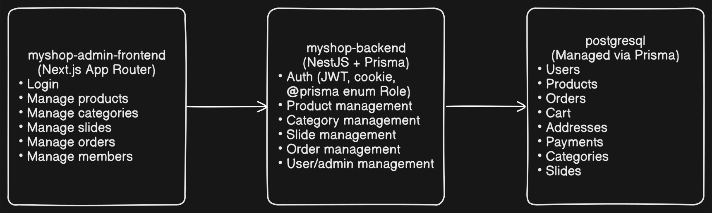
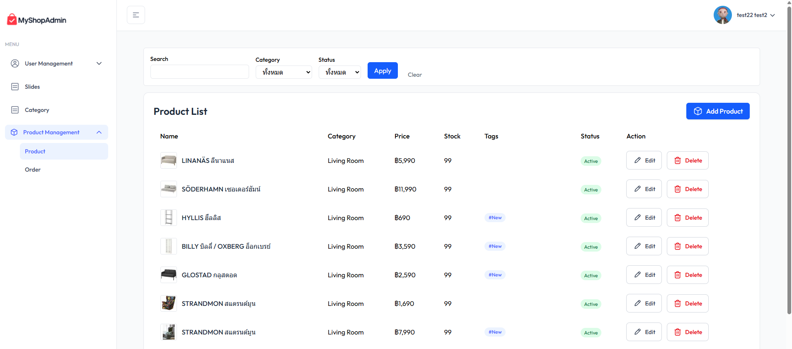
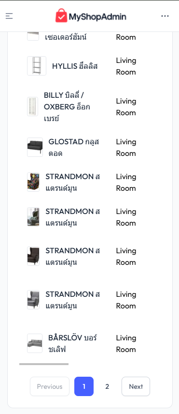
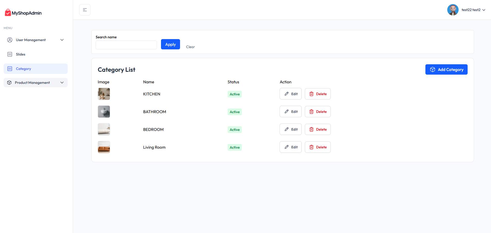
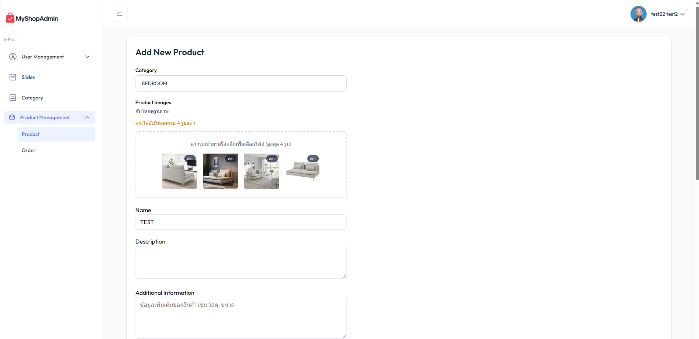

# 🛒 MyShop Admin (Frontend)

MyShop Admin is a modern and responsive **admin panel** for managing your eCommerce platform. Built with **Next.js 15**, **React 19**, **TypeScript**, and **Tailwind CSS**, it offers a powerful foundation for managing products, orders, users, and more.

---

## 🧩 MyShop Admin Architecture Diagram



---

## 🌐 Web UI Preview

### 🖥 Desktop View



### 📱 Mobile View



This project is optimized for performance and flexibility, enabling developers to quickly build a fully functional.

## 🔧 Tech Stack

- **Next.js 15** – App Router, Server Components
- **React 19** – New hooks and improvements
- **TypeScript** – Type safety for scalability
- **Tailwind CSS** – Utility-first responsive styling

---

## 🚀 Getting Started

### Prerequisites

- Node.js 18+ (Node.js 20+ recommended)
- Package manager: `npm`, `yarn`, or `pnpm`

### Installation

```bash
git clone https://github.com/chonlapat323/myshop-admin-frontend
cd myshop-admin
npm install
# or
yarn install
```

### Running in Development

```bash
npm run dev
# or
yarn dev
```

Visit `http://localhost:3000` to view the admin panel.

---

## 📁 Folder Structure

```
├── app/               # Next.js App Router Pages
│   └── (admin)/       # Admin routes (products, orders, etc.)
├── components/        # Reusable UI components
├── hooks/             # Custom hooks for state logic
├── services/          # API communication
├── public/            # Static files (images, logos, etc.)
├── types/             # TypeScript interfaces and types
```

---

## ✨ Features

- Product Management (CRUD, search, filter)
- Order Management with status tracking
- Member & Address Management
- Slide & Category System
- Image upload with drag & drop
- Reusable filters and table components
- Responsive Design & Dark Mode Ready

---

## 📷 Screenshots

| Category View                                   | Product Form                                   |
| ----------------------------------------------- | ---------------------------------------------- |
|  |  |

---

## 📦 Deployment

You can deploy this project on [Vercel](https://vercel.com) or your preferred platform.

```bash
npm run build
npm start
```

---
